# iRoute architecture

## Repository structure

The repository is one .NET codebase with six top-level projects. There are no
`Application`, `Infrastructure`, `Hosts`, or `Clients` wrapper directories:

| Project | Responsibility |
|---|---|
| `src/iRoute.Common` | The single home for public contracts, DTOs, interfaces, ports, options, and shared primitives |
| `src/iRoute.Services` | Policies, routing, capability/gateway logic, and execution implementations |
| `src/iRoute.Data` | EF Core contexts, entities, migrations, and durable/in-memory stores |
| `src/iRoute.Core` | Small execution facade that delegates through contracts owned by Common |
| `src/iRoute.Runtime` | The only executable and composition root: API, workers, migrations, and client CLI |
| `src/iRoute.Tests` | Boundary tests and behavior tests across the five production projects |

The modular monolith has one composition root and an acyclic dependency graph.
Common is the only contract boundary. Core, Services, and Data each depend on
Common, but never on one another. Runtime is the only project allowed to assemble
concrete services and stores. A return from a service or store to Core is a method
result, not a reverse project reference.

Within each project, code is grouped by feature. Services separates executions,
routing, resolution, policies, context, validation, capabilities, gateways,
project state, and observability. Data separates Entity Framework, in-memory
stores, migrations, gateway state, and observability projections. Runtime
separates API, hosting, migrations, client commands, and composition. Catch-all
files and unrelated `Helpers` classes are not accepted destinations.

## Runtime topology

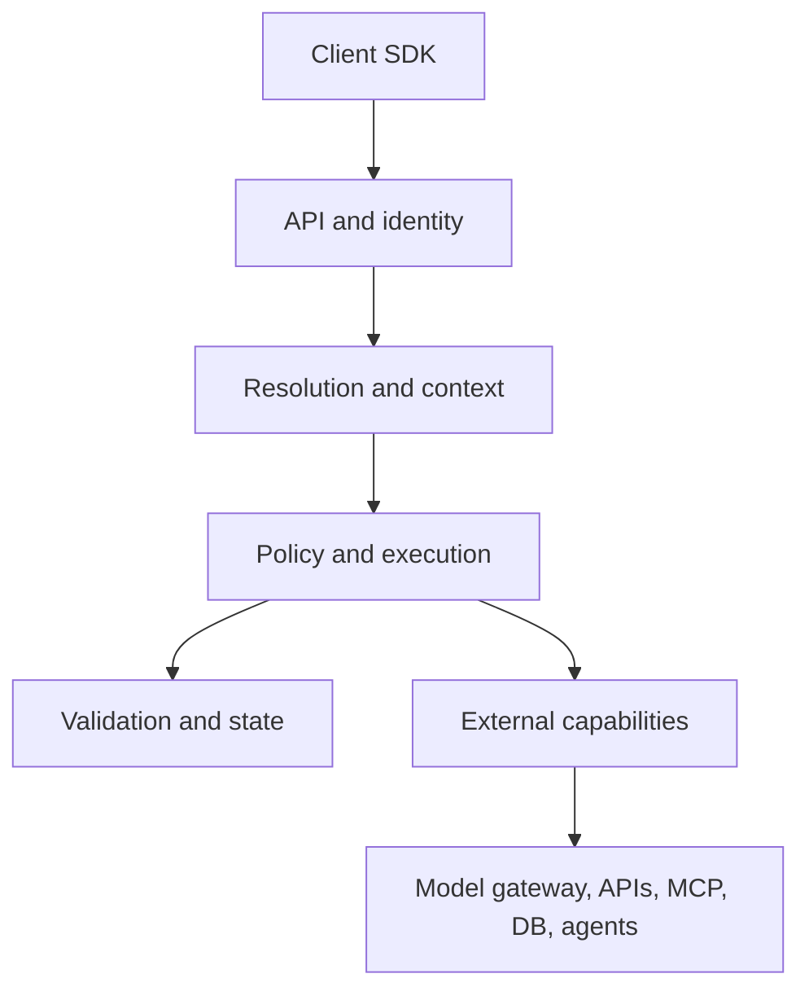

Models are capabilities, not the control plane. The policy engine authorizes the compiled plan before executors can call an external system.

The current `email.draft` vertical slice follows this concrete path:

```mermaid
flowchart LR
    A["Typed request"] --> B["Tenant idempotency"]
    B --> C["Exact artifact lookup"]
    C -->|"hit"| H["Validate reuse"]
    C -->|"miss"| D["Compile and validate typed plan"]
    D --> K["Persist workflow and step checkpoints"]
    K --> E["Compile bounded context"]
    E --> F["Bounded dependency scheduler"]
    F --> G["Gateway execution"]
    G --> J["Validate and materialize"]
    J --> H
    H --> I["Persist outcome and events"]
```

The W04 external-action path is deliberately gated and resumable:

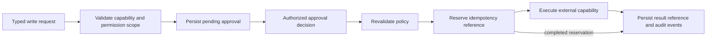

The W05 project-state path makes reuse dependency-aware:

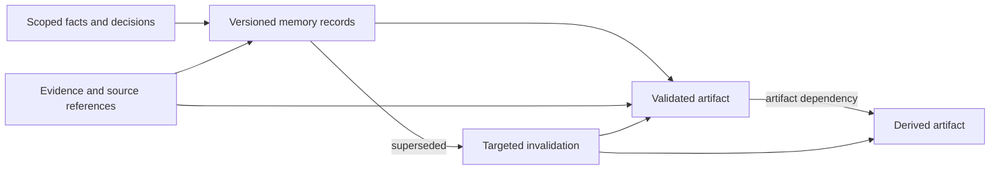

Each artifact lineage is identified by tenant, project, artifact type, and logical key. Only one version is active. An unchanged input/content pair deduplicates; a changed result creates the next version and records its predecessor. Facts and decisions use the same versioned lifecycle. Dependency edges hold references and hashes rather than copied payloads, allowing deterministic freshness checks and recursive invalidation.

W06 resolves work through an ordered, fail-closed no-model chain:

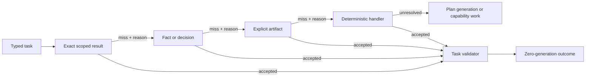

Every resolver checks authenticated task permissions before reading state. Stored results additionally require matching tenant/project scope, current task version, active lifecycle, and freshness. Accepted candidates still pass the task-specific output validator. Each attempt emits a payload-free decision reason, making misses and reuse observable without disclosing artifact or memory content.

W07 compiles unresolved work from bounded, ranked evidence rather than accumulated history:

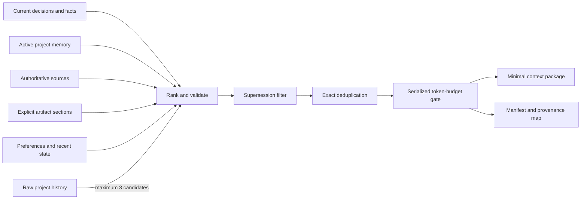

Current request state outranks stored memory for the same logical key. Active decisions outrank artifacts, preferences, summaries, and raw history. Stored candidates must match tenant/project scope and be active and unexpired; artifacts are retrieved only from explicit `contextArtifacts` references and projected to requested top-level sections. Context-source fields are removed from the model's task input and reintroduced only through the bounded package. Every included JSON path maps to an `EvidenceReference`, while excluded candidates retain a safe reason in the manifest. The compiler estimates projected task input plus the complete serialized context after each proposed insertion, so raw history and object/array framing cannot push the model request above its task budget.

W08 routes unresolved work from provenance-bearing policy inputs:

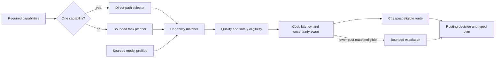

The direct selector never invokes the planner for a one-capability task. The deterministic planner compiles multiple required capabilities into a typed DAG once and cannot raise task-definition or request limits. Capability matching rejects candidates that miss the allow list, task coverage, health, mandatory quality floor, deadline, context/output capacity, cost ceiling, call budget, or model-profile provenance invariants. Every profile is explicitly `Synthetic`, `Unverified`, or `Measured`; a measured profile is eligible only when it carries provider, model, timestamp, and positive sample-count metadata. The versioned routing decision preserves every candidate's policy inputs, source, optional measurement record, score, eligibility, and reason; it is emitted as an event, persisted beside the workflow plan, passed to the model gateway through the selected profile ID, and returned with generated outcomes.

W09 keeps every provider protocol behind one external gateway boundary:

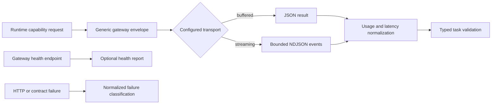

The request contains capability, profile, projected input, compiled context, maximum output tokens, correlation ID, and deadline—not a provider model name or provider payload. Both transports end in the same typed result. Streaming sequences and sizes are bounded before validation; generated deltas are counted but never persisted in audit data. Runtime-measured wall-clock latency replaces gateway-reported duration so buffered and streaming calls are comparable. Health is reported through a dedicated endpoint and is excluded from API readiness because model execution is an optional capability. Provider credentials, aliases, and protocols remain responsibilities of the registered generic gateway routes in Infrastructure or an external gateway deployment, never Core or Runtime concerns.

W18 adds deterministic resilience between registered generic gateway deployments without adding provider adapters to Core:

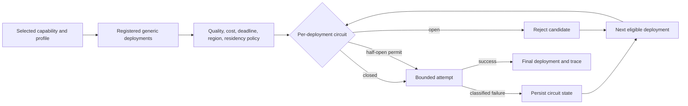

The gateway layer is the single owner of model-deployment fallback. Workflow model steps therefore have one scheduler attempt; tool retries retain the W17 scheduler policy. Each attempt targets an operator-registered generic HTTP route and carries no provider-specific request fields. SQLite and PostgreSQL persist circuit state, while a fenced half-open probe lease ensures only one worker tests a recovering deployment. Candidate and attempt evidence becomes durable execution events and low-cardinality metrics. Adaptive routing and online learning are separate future policy layers.

Routing and model-profile changes require externally recorded evaluation evidence
covering quality, safety, cost, latency, and unsupported claims before release.
The repository intentionally contains no evaluation harness or fixture corpus.

W11 gives every non-model transport one normalized execution boundary:

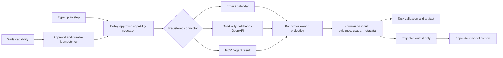

Core owns the connector registry/executor ports and Contracts owns the transport-neutral envelopes. Infrastructure owns transport registration, input restrictions, response projection, and reference adapters. Runtime never receives a raw transport response: it sees a projected `JsonElement`, evidence, confidence, normalized usage, and safe connector metadata. Model dependencies are deserialized from the normalized checkpoint envelope and only their projected output is added under `capabilityOutputs`; connector identity and other metadata remain in audit events. Writes stay on the approval and durable external-action path before reaching the same normalized executor.

W12 bounds reusable state through an asynchronous, dependency-aware lifecycle:

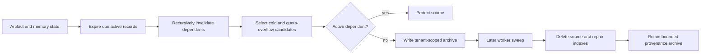

Core owns lifecycle policy, results, deletion requests, storage snapshots, and the lifecycle-store port. Infrastructure implements equivalent in-memory and EF cleanup engines. The Worker owns cadence and count-only logging. Expiry and explicit deletion both invalidate dependent memory and artifacts before source removal. Archival is idempotent and tenant-scoped; a newly created archive can never authorize deletion in the same sweep. Physical deletion removes dependency edges and broken supersession pointers, while archive retention remains independently bounded.

W13 makes runtime behavior inspectable without creating a second source of truth:

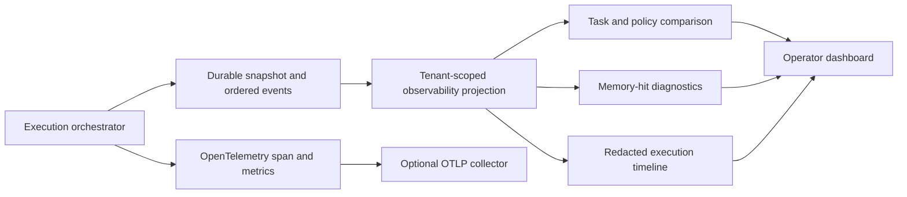

The durable execution snapshot and event stream remain the query source for the dashboard, so a restart does not split operational truth between application and telemetry stores. Runtime spans use hashed references and low-cardinality task/policy/status tags; metrics record counts and measurements only. The trace ID written with `execution.created` correlates an exported span with its durable timeline. Infrastructure owns bounded aggregation and recursive redaction. API identity supplies the tenant scope and never accepts an unscoped observability query.

## Code dependency topology

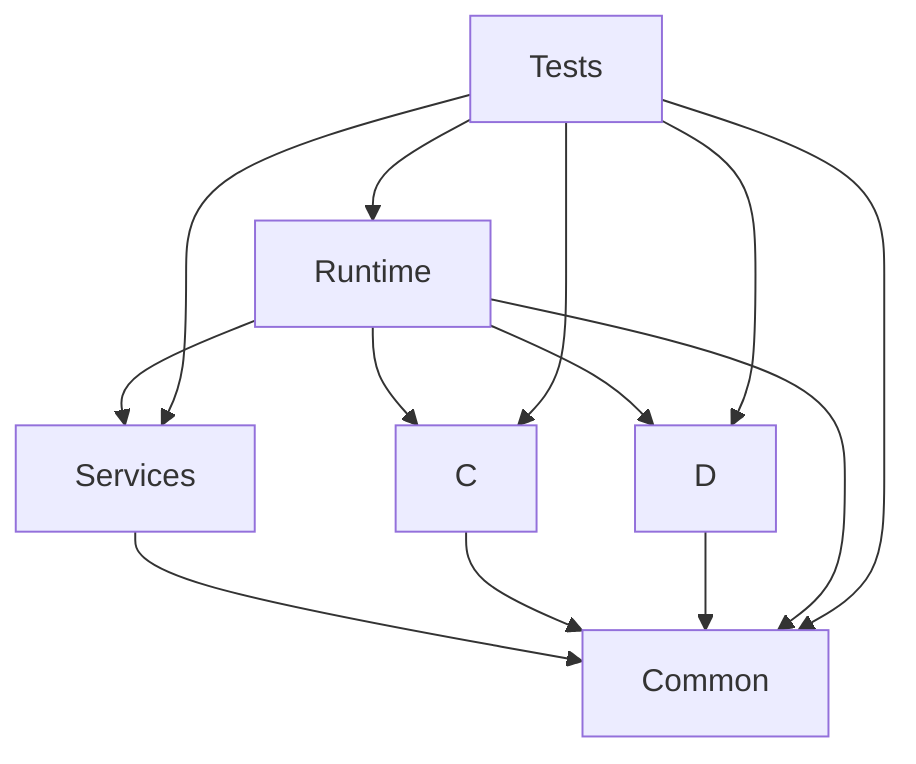

Arrows mean “depends on.” Reverse references and cycles are forbidden and are
checked by `iRoute.Tests`.

## Module ownership

| Project | Owns | Must not own |
|---|---|---|
| Common | contracts, DTOs, interfaces, ports, enums, shared options and primitives | execution, routing, persistence, hosting implementations |
| Services | routing/policy logic, connectors, gateways, execution implementation | duplicate contracts, EF contexts, migrations, API endpoints |
| Data | DbContext, entities, migrations, store implementations | routing or request policy decisions |
| Core | stable execution facade and delegation | persistence, provider calls, routing rules, composition |
| Runtime | DI composition, API/SSE, dashboard, workers, migrations, client CLI | duplicate business or persistence rules |
| Tests | architecture and behavior verification | production implementation |

## State transition

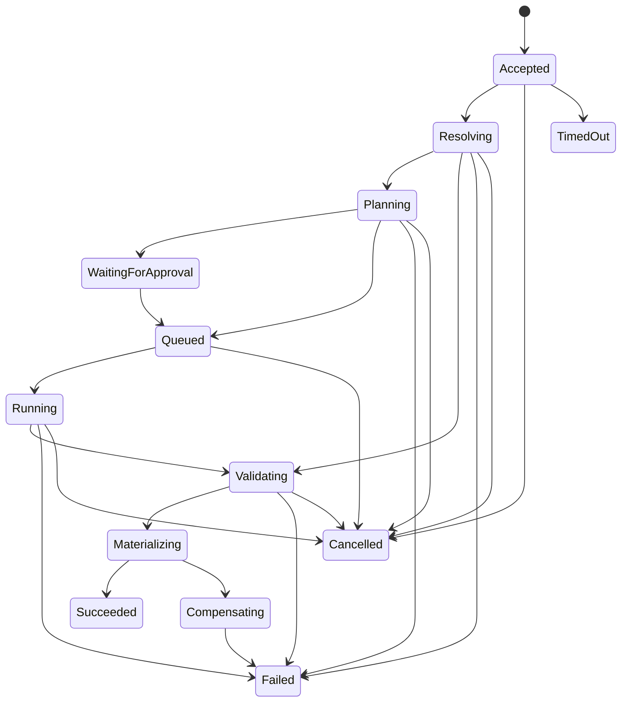

Every transition is persisted and emits an ordered event. Terminal states are immutable.

## Persistence profiles

There are two storage providers. `Postgres` is the deployment target and the only provider that supports more than one execution worker, because durable leases, event sequencing, and gateway circuit state are all coordinated through the database. `Sqlite` is the single-node development and evaluation profile; it serialises every write through one file and cannot coordinate workers across hosts, so the host logs a warning when it is used outside `Development`. Both providers store executions, work items and leases, validated plans and routing decisions, per-step attempts and outputs, events, artifacts, memory records, dependency edges, lifecycle archives, approvals, external-action reservations, and per-deployment circuit state through the same ports. The persistence design includes guarded claims, lease fencing, expiry and takeover, workflow recovery, cancellation, approval resumption, routing-decision preservation, circuit reconstruction, project-state lifecycle parity, and two-phase archival/deletion.

`Storage:AutoInitialize` applies checked-in EF migrations only in local profiles. Production API and worker processes disable it and depend on the one-shot migration image. Readiness fails while known migrations are pending. The initial migration contains provider-specific SQL so SQLite uses its native storage representation while PostgreSQL uses native UUID and boolean columns. Future changes must follow expand-and-contract migration rules.

## Deployment topology

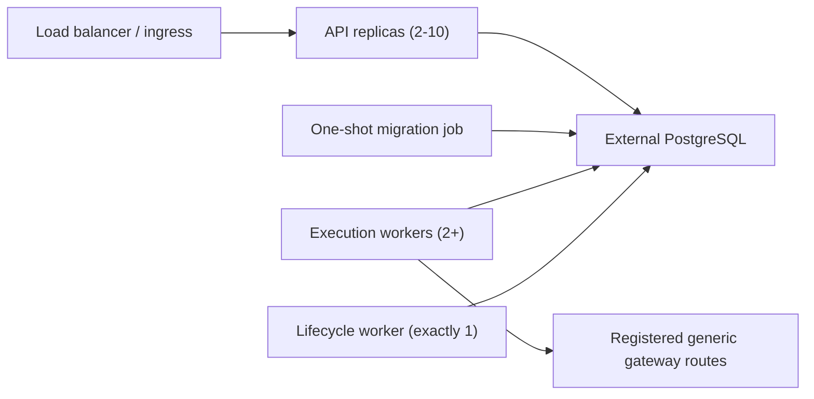

API replicas persist submissions and serve durable reads over one PostgreSQL schema. Execution workers claim work with expiring fenced leases and scale independently; the lifecycle worker remains single-instance. A migration job upgrades the schema before new pods become ready. SQLite is intentionally limited to the local API-plus-worker profile.

## Identity boundary

The API has two explicit identity profiles. `DevelopmentHeaders` accepts local tenant, actor, and permission headers for a credential-free developer loop and is rejected at startup unless the host environment is exactly `Development`. `Jwt` is mandatory outside Development, validates bearer tokens against a configured authority and audience, requires a tenant claim, derives actor identity and permission scopes from claims, and ignores caller-controlled scope headers. Runtime stores, approvals, external actions, memory, dependency edges, and reuse indexes remain tenant-scoped as a second line of isolation. Artifact and memory direct-read ports require tenant identity, so filtering cannot be deferred until after a record is loaded.

## .NET implementation standards

iRoute uses the platform before adding a project-specific abstraction. This is
not a rule to use every available framework feature; a feature is adopted when
it removes custom infrastructure, makes correctness enforceable, or improves a
measured hot path without hiding product policy.

- Use `TimeProvider` for current time and timer-based delays. Domain and
  application code must not call `DateTimeOffset.UtcNow`, and must not introduce
  another clock interface.
- Bind host configuration through the options pattern. Every non-trivial
  options type has an `IValidateOptions<T>` implementation and is validated at
  host startup. Data-annotation-only options use the compile-time options
  validator generator.
- Use System.Text.Json source-generation contexts at public HTTP, SDK, and
  model-gateway serialization boundaries. Reflection remains acceptable for
  genuinely open-ended internal diagnostic payloads.
- Use `FrozenDictionary` and `FrozenSet` for immutable, repeatedly queried
  registries. Use ordinary collections for request-local or mutable state.
- Use `BackgroundService`, dependency-injection scopes, `HttpClientFactory`,
  health checks, OpenTelemetry, and generated logging in their owning layers.
  Long-running work accepts cancellation and never blocks on asynchronous code.
- Keep retry and circuit policy explicit in the gateway layer. Adding a generic
  HTTP resilience handler there would duplicate attempts and could silently
  exceed task model-call, cost, or deadline budgets.
- Public contracts remain records and enums in Contracts. Core owns ports and
  invariants, Runtime owns use-case coordination, Infrastructure owns adapters,
  and hosts own only configuration and process composition.
- Prefer one primary responsibility per service and one cohesive concept per
  file. Files above roughly 500 lines or services with several unrelated
  collaborator groups trigger an architecture review; the number is a review
  signal, not a reason to create arbitrary fragments.

`Directory.Build.props` enforces nullable analysis, warnings as errors, the
latest recommended .NET analyzer set, code-style analysis, deterministic builds,
and the repository language version. `.editorconfig` is the single formatting
and C# style policy. `dotnet format --verify-no-changes` is part of the local and
CI verification contract. A broader `latest-all` analyzer audit is useful as a
periodic debt report, but is not the build gate because enabling hundreds of
rules at once obscures the defects the gate is intended to prevent.

See [ADR-005](adr/ADR-005-modern-dotnet-foundations.md) for the decision and
trade-offs.

## Extension rules

- New tasks enter through versioned task definitions and handlers.
- New deterministic or external capabilities implement Core ports.
- New model providers belong behind the generic gateway.
- New gateway routes register provider identity only as operational metadata; provider SDKs and wire protocols never enter Core or Runtime.
- New storage profiles implement state ports and must pass the same isolation and consistency suite.
- The .NET SDK is derived from the versioned public contract and wrapped idiomatically.
- New adaptive policies require offline evaluation and rollback.

## Adopter and contributor entry points

The public adoption boundary is the v1 OpenAPI/JSON Schema surface, official
the .NET SDK, CLI, documented configuration, health endpoints, and release artifacts.
An adopter does not need Core, Runtime, Infrastructure, or provider internals to
execute and observe a task. The clean path is:

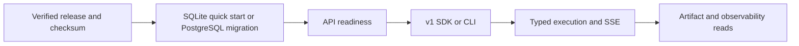

Contributors should enter at the narrowest owning module: wire shape in
Contracts/specification, invariants and ports in Core, orchestration in Runtime,
adapters and persistence in Infrastructure, composition in hosts, and transport
ergonomics in the .NET SDK. A change that crosses these ownership lines needs an
explicit explanation and, for a durable boundary decision, an ADR.

Release tooling is outside the runtime dependency graph. `release.json` is the
canonical release coordinate; the release gate checks package/image alignment,
community policies, clean-install documentation, ignored private references,
and tag-gated publication. It cannot weaken runtime, contract, migration, SDK,
or evaluation gates.
