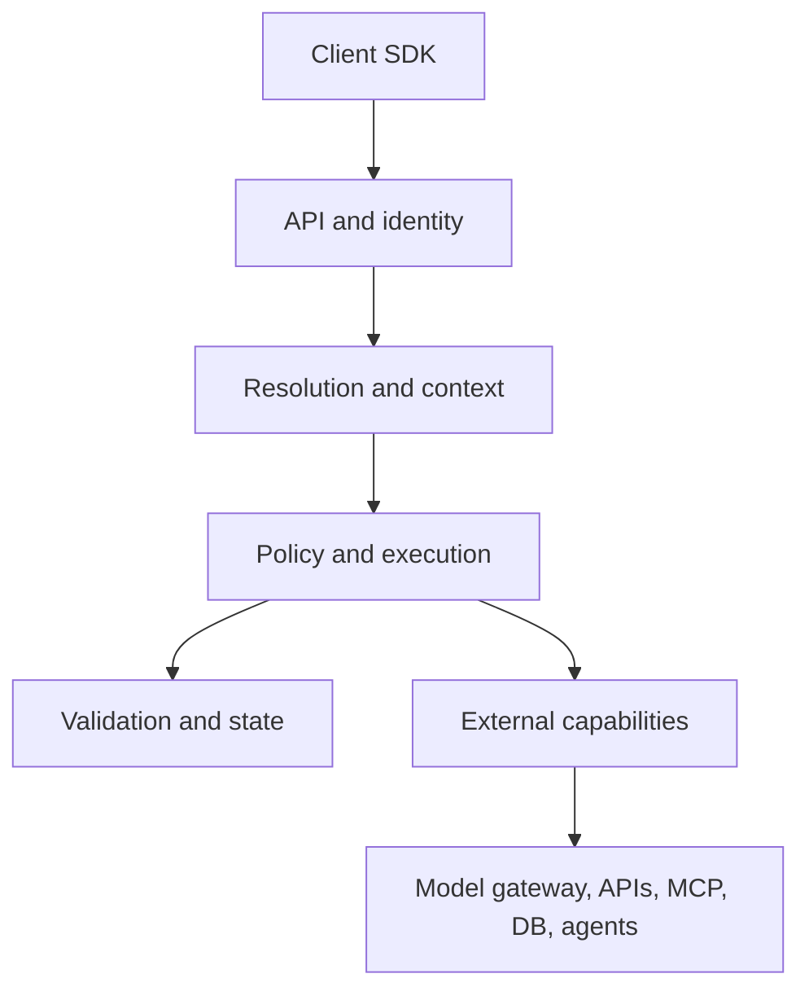
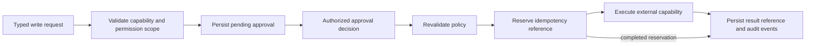
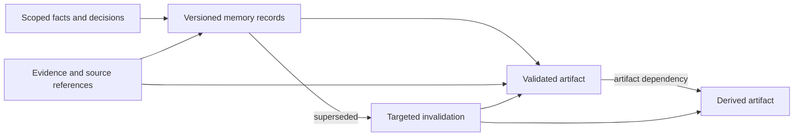
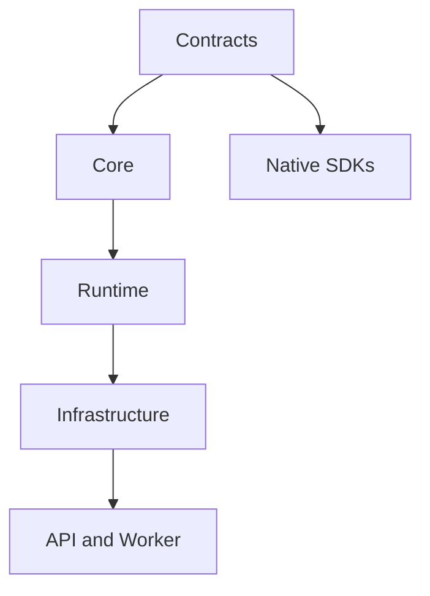
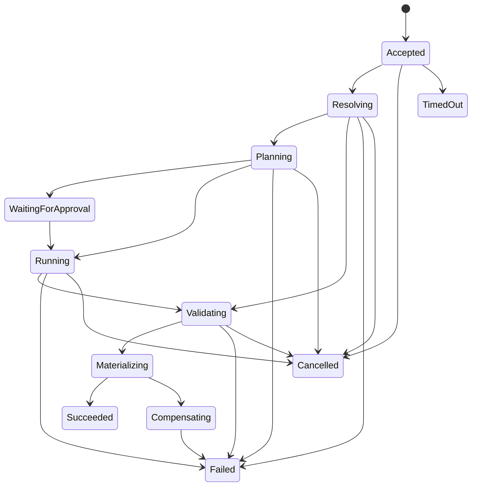

# iRoute architecture

## Runtime topology

Models are capabilities, not the control plane. The policy engine authorizes the compiled plan before executors can call an external system.

The current `email.draft` vertical slice follows this concrete path:

```mermaid
flowchart LR
    A["Typed request"] --> B["Tenant idempotency"]
    B --> C["Exact artifact lookup"]
    C -->|"hit"| H["Validate reuse"]
    C -->|"miss"| D["Compile and validate typed plan"]
    D --> K["Persist workflow and step checkpoints"]
    K --> E["Compile bounded context"]
    E --> F["Bounded dependency scheduler"]
    F --> G["Gateway execution"]
    G --> J["Validate and materialize"]
    J --> H
    H --> I["Persist outcome and events"]
```

The W04 external-action path is deliberately gated and resumable:

The W05 project-state path makes reuse dependency-aware:

Each artifact lineage is identified by tenant, project, artifact type, and logical key. Only one version is active. An unchanged input/content pair deduplicates; a changed result creates the next version and records its predecessor. Facts and decisions use the same versioned lifecycle. Dependency edges hold references and hashes rather than copied payloads, allowing deterministic freshness checks and recursive invalidation.

## Code dependency topology

Arrows mean “may be depended upon by.” Reverse references are forbidden.

## Module ownership

| Project | Owns | Must not own |
|---|---|---|
| Contracts | wire records, enums, compatibility | persistence or routing behavior |
| Core | state rules, entities, ports, policies | HTTP, EF Core, provider formats |
| Runtime | use cases, orchestration, context, scheduling | host configuration or provider SDKs |
| Infrastructure | persistence, HTTP gateway, telemetry | product policy decisions |
| API | HTTP/SSE and composition | business logic |
| Worker | durable jobs and lifecycle host | duplicate runtime rules |
| SDKs | idiomatic clients | routing, prompts, memory logic |

## State transition

Every transition is persisted and emits an ordered event. Terminal states are immutable.

## Persistence profiles

`Memory` is an isolated test profile. `Sqlite` is the default single-node developer profile. `Postgres` is the durable team/container profile. Both durable providers store executions, validated plans, per-step attempts and outputs, events, artifacts, memory records, dependency edges, approvals, and external-action reservations through the same ports. Restart tests cover workflow recovery, approval-gated action resumption, and project-state lifecycle parity.

`Storage:AutoInitialize` applies checked-in EF migrations. The initial migration contains provider-specific SQL so SQLite uses its native storage representation while PostgreSQL uses native UUID and boolean columns. Future changes must follow expand-and-contract migration rules.

## Identity boundary

The API has two explicit identity profiles. `DevelopmentHeaders` accepts local tenant, actor, and permission headers for a credential-free developer loop. `Jwt` validates bearer tokens against a configured authority and audience, requires a tenant claim, derives actor identity and permission scopes from claims, and ignores caller-controlled scope headers. Runtime stores, approvals, external actions, memory, dependency edges, and reuse indexes remain tenant-scoped as a second line of isolation. Artifact and memory direct-read ports require tenant identity, so filtering cannot be deferred until after a record is loaded.

## Extension rules

- New tasks enter through versioned task definitions and handlers.
- New deterministic or external capabilities implement Core ports.
- New model providers belong behind the generic gateway.
- New storage profiles implement state ports and must pass the same isolation and consistency suite.
- New SDKs are generated from OpenAPI and wrapped idiomatically.
- New adaptive policies require offline evaluation and rollback.
